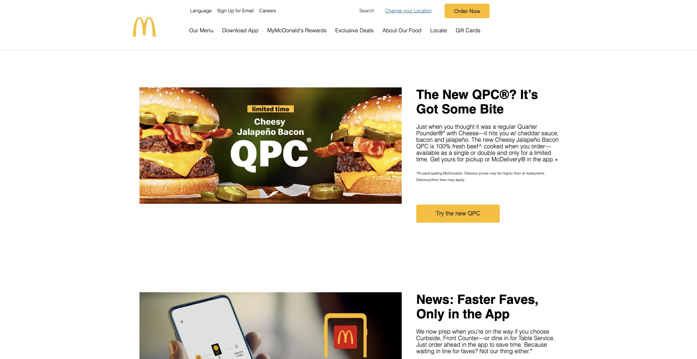
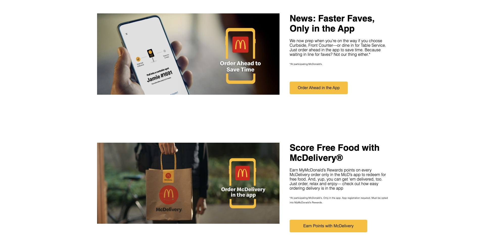
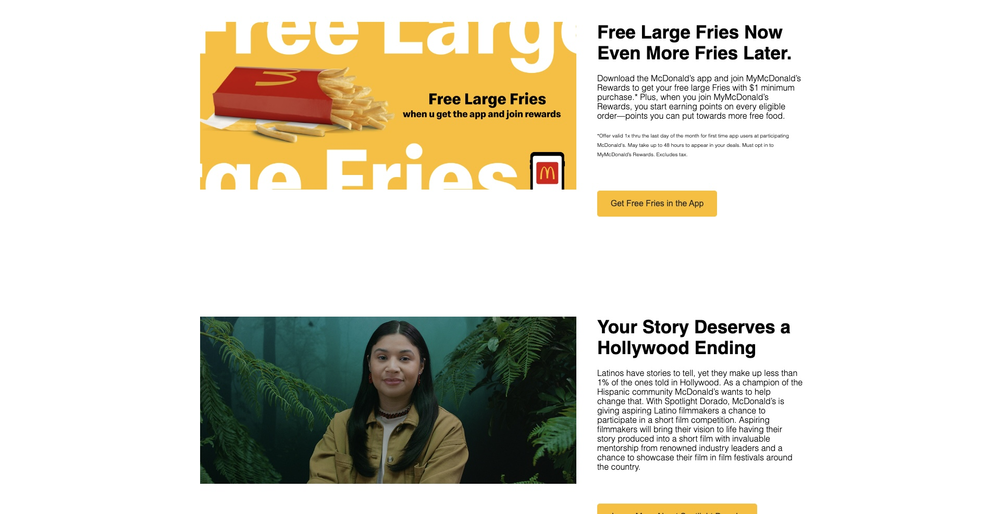
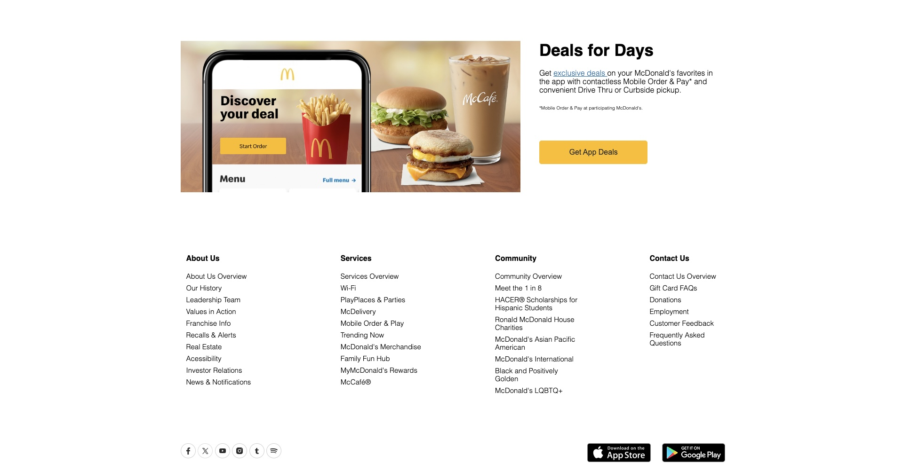
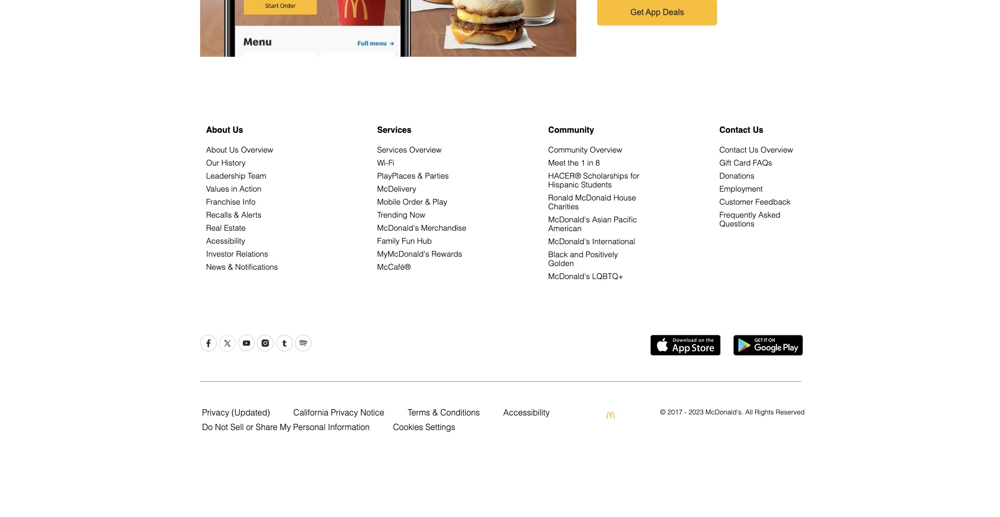
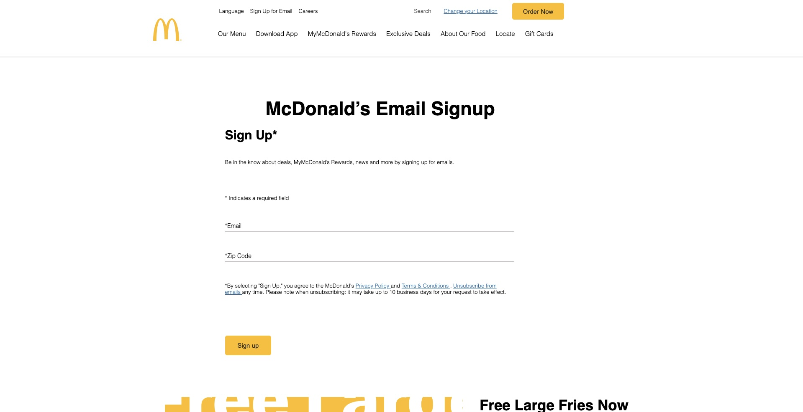
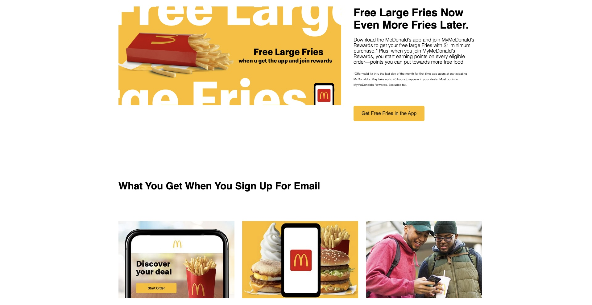
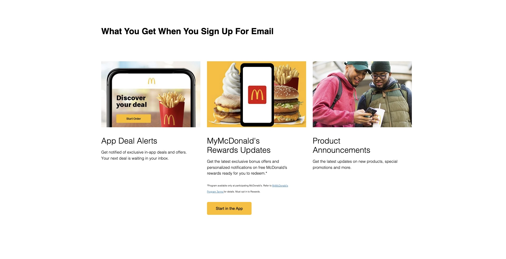
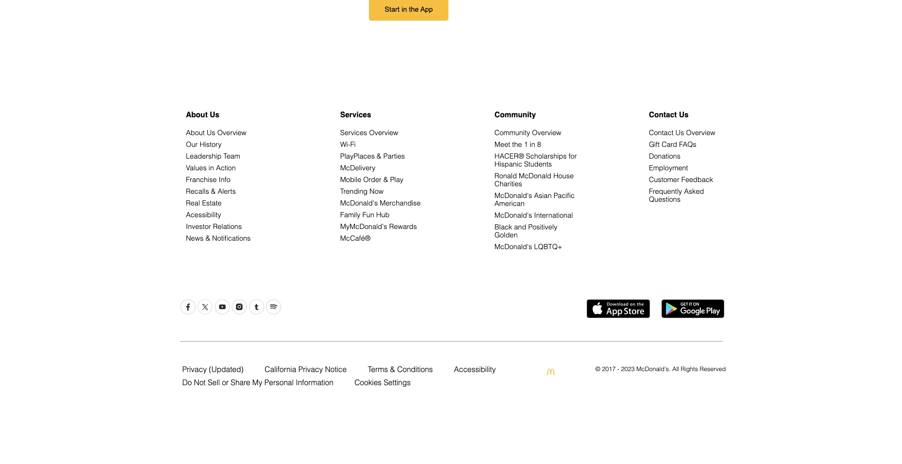

🍔🍟🥤 McDonald's Landing Page Clone 🍔🍟🥤

 

``HTML`` | ``CSS``

 

An extensive McDonald's website clone featuring a variety of pages to provide an immersive user experience.
The comprehensive clone offers a true-to-life experience, making it a valuable learning resource for both developers and McDonald's enthusiasts.
It also serves as a practical showcase of web development skills, including front-end technologies such as HTML, CSS, and JavaScript.
 
 
 
Overview:
 
 
 

This project is a comprehensive clone of the official McDonald's website, meticulously crafted to showcase web development skills and provide users with an authentic experience. It includes the following pages:

Home Page: Welcome users and offer quick access to various sections.

Menu: Present the entire McDonald's menu with customization options.

Careers Page: Explore job opportunities and begin your journey with McDonald's.

Rewards Page: Highlight loyalty programs and their perks for frequent customers.

Download App Page: Promote the McDonald's mobile app with direct download links.

Deals Page: Showcase current promotions, discounts, and special offers.

Gift Card Page: Provide an option to purchase McDonald's gift cards online.

Sign Up for Email Page: Capture user information for email subscriptions.
 
 
 
Key Features:
 
 
 
Full Menu Display: Browse McDonald's extensive menu, complete with customization options for a personalized ordering experience.

Career Opportunities: Explore various job openings at McDonald's, view job descriptions, and apply directly on the careers page.

Loyalty Rewards: Learn about McDonald's loyalty programs, their benefits, and sign up to start earning rewards.

Mobile App Promotion: Access and download the official McDonald's mobile app for exclusive features and convenience.

Deals and Promotions: Stay informed about the latest deals, discounts, and limited-time offers.

Gift Card Purchase: Buy McDonald's gift cards as presents or for personal use, directly from the website.

Email Subscription: Sign up for email updates to receive exclusive offers and stay updated with McDonald's news.
 
 
 

 
 
 

